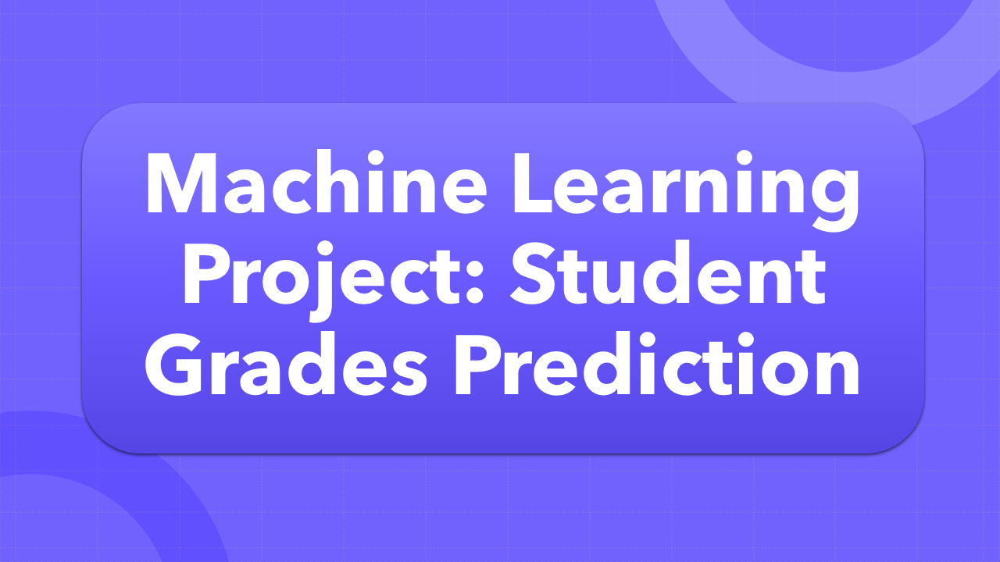

# Student Grade Prediction

## Project Overview

This project aims to predict students' final grades based on various factors such as attendance, participation, previous scores, and demographics. Using a **supervised learning** classification approach, the goal is to identify patterns in the dataset that can help predict student performance. The target variable, which represents the final grade, is categorical, making this a classification problem.

The dataset used in this project is the **Students Grading Dataset**, available on Kaggle. You can download the dataset [here](https://www.kaggle.com/datasets/mahmoudelhemaly/students-grading-dataset).

## Key Objectives

- **Predict Student Grades**: By building and training machine learning models to predict student grades based on historical data.
- **Improve Educational Systems**: By identifying key factors affecting students' grades, educational institutions can use these insights for early intervention and improvements.
- **Model Evaluation**: Several machine learning models were evaluated for performance, including Logistic Regression, Random Forest, XGBoost, and Support Vector Machines (SVM).

## Features

The dataset contains the following features:
- **Demographics**: Information like gender, age, etc.
- **Academic History**: Scores from previous assessments, attendance, participation.
- **Other Factors**: Additional data that might influence performance.

## Project Workflow

### 1. Data Preprocessing

- **Data Cleaning**: Handled missing values, gender inconsistencies, and unnecessary columns.
- **Feature Engineering**: Improved the grade system and selected relevant features for the model.
- **Encoding and Scaling**: Categorical variables were encoded, and features were scaled for consistency.

### 2. Model Training

Multiple machine learning models were trained to predict the final grades:

- **Logistic Regression**: Achieved an accuracy of 97.3%. A solid baseline model for the dataset.
- **Random Forest**: Achieved an accuracy of 99.9%. This model showed excellent performance but might be prone to overfitting.
- **XGBoost**: Similar performance to Logistic Regression, with an accuracy of 97.3%. It handles imbalances well but still lags behind Random Forest.
- **SVM**: Achieved an accuracy of 87.8%, performing the weakest among all models, particularly with classifying certain categories.

### 3. Model Tuning

- **Hyperparameter Tuning**: Used GridSearchCV to fine-tune the Logistic Regression and Random Forest models, improving performance and reducing overfitting.
- **Overfitting Evaluation**: Ran checks on both Logistic Regression and Random Forest to ensure that the models generalized well on unseen data.

### 4. Final Model

The best-performing model was **Logistic Regression**, with the following results after hyperparameter tuning:

- **Training Accuracy**: 99.65%
- **Test Accuracy**: 99.60%

The model showed strong generalization, with minimal overfitting, as the training and test accuracies were close.

## Key Insights

- **Random Forest** performed exceptionally well but might be overfitting the data due to its high accuracy.
- **Logistic Regression**, after fine-tuning, outperformed other models in terms of balance between accuracy and generalization.
- **SVM** was the least effective model, particularly in terms of accuracy, and didn't perform well on this dataset.
  
## Conclusion

The **Logistic Regression** model, after hyperparameter tuning, emerged as the best model for predicting student grades with an accuracy of 99.60%. It demonstrated excellent performance across all classes, as shown by its high precision, recall, and F1-score metrics.
